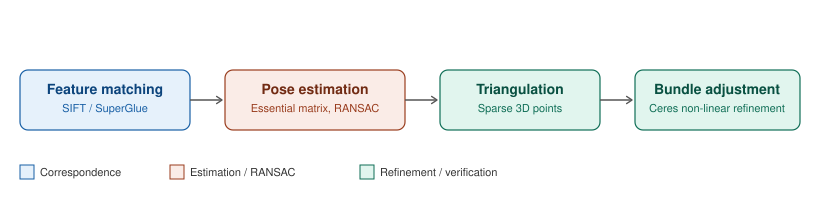
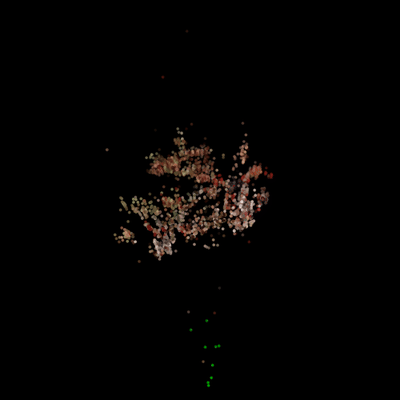
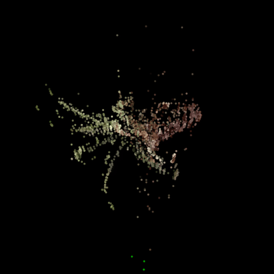
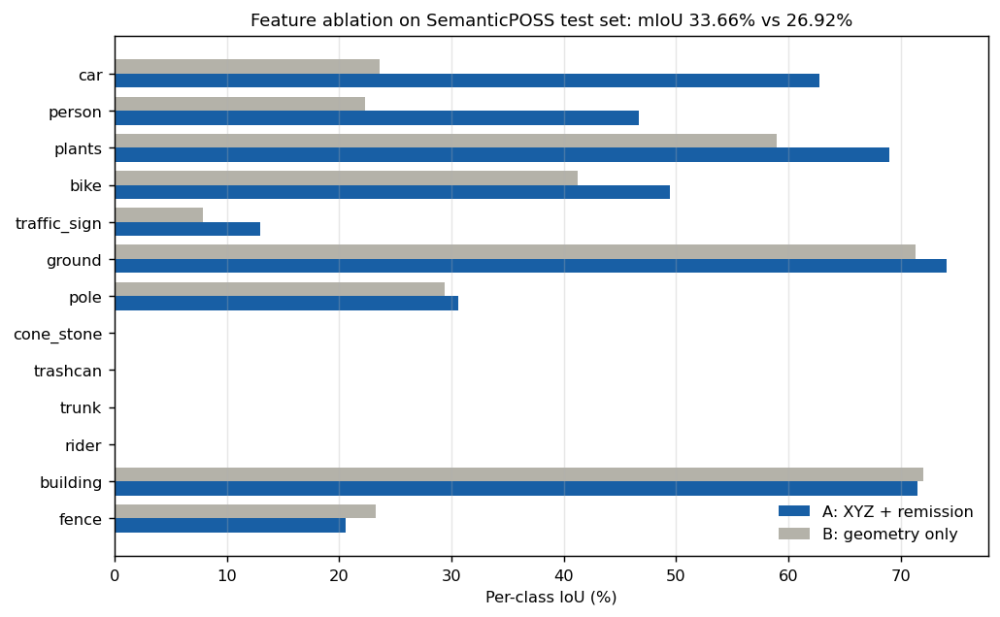

# 3D Data Processing, University of Padova

Four laboratory projects covering the 3D computer vision pipeline end to end: from raw stereo and LiDAR sensing, through classical multi-view geometry and optimization, to learned representations on sparse 3D data.


Author: Giuseppe D'Auria.

---

## The labs

### [Lab 1: Semi-Global Matching with monocular depth fusion](lab1-sgm-stereo/)

Census-based SGM extended with gradient-adaptive smoothness penalties and a confidence-gated fusion stage that repairs low-confidence regions using a monocular depth prior, calibrated by least-squares estimation of its unknown affine scale.


`C++` `OpenCV` `Eigen` — Middlebury Aloe, Cones, Rocks1, Plastic

---

### [Lab 2: Incremental Structure from Motion](lab2-structure-from-motion/)

Sparse 3D reconstruction from uncalibrated image sequences: feature correspondence (classical SIFT or learned SuperGlue), essential matrix estimation under RANSAC, triangulation, and joint refinement of poses and structure by bundle adjustment in Ceres.



| Dataset 1, 3466 points | Dataset 2, 3839 points |
|---|---|
|  |  |

`C++` `OpenCV` `Ceres` `SuperGlue` — collaborative, with Francesco Carretta and Anna Mainardis

---

### [Lab 3: Full point cloud registration](lab3-point-cloud-registration/) · 27/30

FPFH descriptor matching with RANSAC for global alignment, followed by ICP refinement. Two ICP solvers implemented from scratch (closed-form SVD and Ceres Levenberg-Marquardt) and benchmarked against three Open3D solvers over a 4 by 4 grid of injected pose noise.


The benchmark separates two regimes cleanly. Bunny and dragon reach a final RMSE that is completely invariant to the initial perturbation (0.212 and 0.433, identical across all sixteen conditions), so a worse starting pose costs iterations but not accuracy. The vase does not: 20 of 32 custom-solver runs exhaust the iteration cap, and at zero noise the custom solvers halt after three iterations at RMSE 1.739 while every Open3D solver reaches roughly 1.17 on the same input. Adding noise then improves the result, which is the signature of a relative-change stopping criterion terminating on a plateau rather than at a minimum.

`C++` `Open3D` `Ceres` `Eigen` — Stanford bunny, dragon, vase

---

### [Lab 4: Sparse convolutional LiDAR segmentation](lab4-minkunet-segmentation/) · 30/30

MinkUNet on SemanticPOSS using the Minkowski Engine, with a custom sparse gated residual block and submanifold convolutions throughout the trunk. Two controlled studies: voxel resolution sensitivity, and a feature ablation isolating the contribution of LiDAR remission.



Remission lifts mIoU from 26.92 to 33.66 percent, but the aggregate conceals the structure of the gain: car improves by 39.15 IoU points and person by 24.39, while building and fence get marginally worse. The benefit concentrates almost entirely in classes whose surface reflectivity separates them from their surroundings, and is absent for large planar structures that geometry already distinguishes.

`Python` `PyTorch` `MinkowskiEngine` `Colab` — SemanticPOSS

---

## Repository layout

```
├── lab1-sgm-stereo/                 SGM stereo + monocular fusion        (C++)
├── lab2-structure-from-motion/      Incremental SfM                      (C++)
├── lab3-point-cloud-registration/   FPFH + ICP registration              (C++)
└── lab4-minkunet-segmentation/      Sparse convolutional segmentation    (Python)
```

Each lab folder is self-contained and holds its own source, input data, raw outputs, written report, and a README documenting the implementation and results. Every figure in this repository was generated from the actual measured outputs committed alongside it; nothing is illustrative or reconstructed.

## Course scope

Depth sensing technologies, rigid body transformations, homographies, epipolar geometry, stereo matching (classical and learned), structure from motion, visual SLAM, 3D data representations, local 3D descriptors, shape registration, and neural implicit representations.
