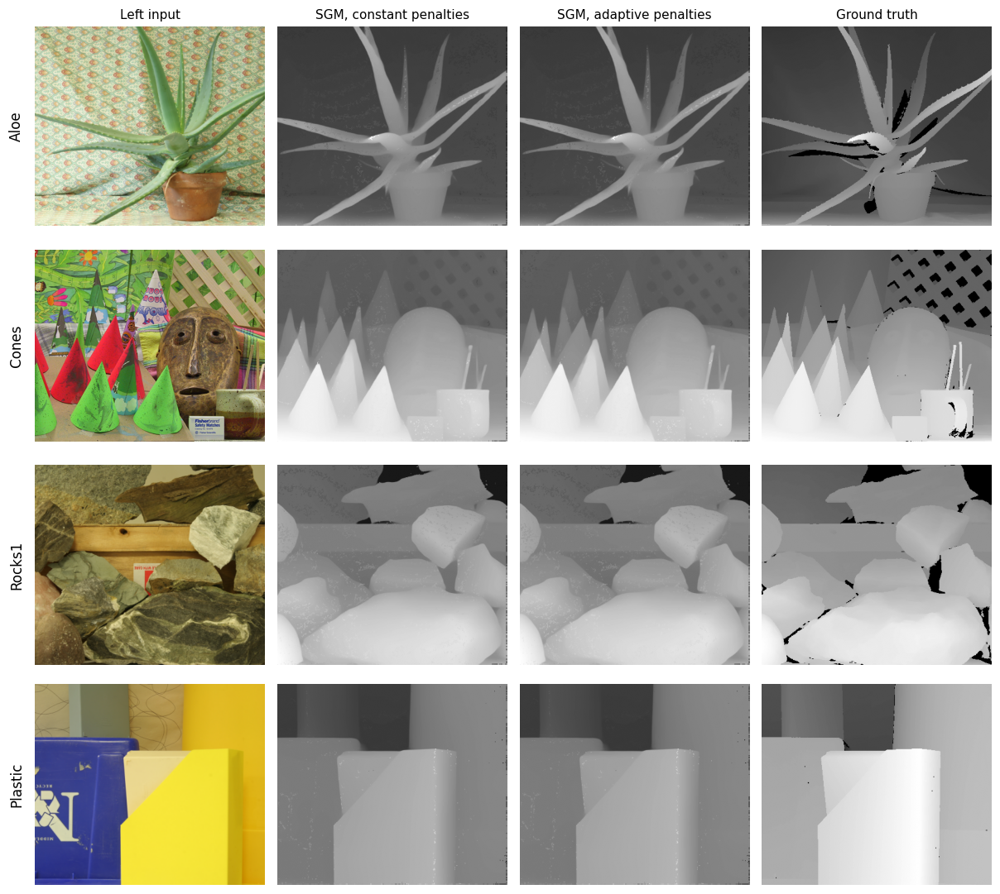
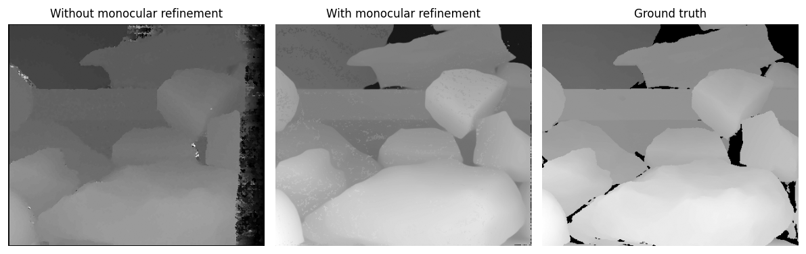

# Lab 1: Semi-Global Matching with Monocular Depth Fusion

Dense disparity estimation from rectified stereo pairs using Census-based Semi-Global Matching, extended with two additions: content-adaptive smoothness penalties, and a confidence-gated fusion stage that repairs low-confidence regions using a scale-calibrated monocular depth prior.

Course: 3D Data Processing, University of Padova. Author: Giuseppe D'Auria.
Language: C++ with OpenCV and Eigen.

## Results

Four standard Middlebury pairs, run end to end. Each row shows the left input, the SGM output with fixed penalties, the SGM output with adaptive penalties, and the ground truth disparity.



## What the two extensions actually do

### Adaptive smoothness penalties

Standard SGM penalizes disparity changes along each aggregation path with two constants: `P1` for a one-step change, `P2` for a jump. Constant penalties impose the same smoothness everywhere, which oversmooths exactly where it hurts most, at object boundaries where a genuine large disparity jump exists.

The implementation scales both penalties down as a function of local image gradient, so a strong intensity edge relaxes the smoothness constraint and lets the disparity field follow the object boundary:

```cpp
unsigned int adapted_p1 = max(1u, static_cast<unsigned int>(p1_ * (1.0f - 0.1f * edge)));
unsigned int adapted_p2 = max(adapted_p1 + 1, static_cast<unsigned int>(p2_ * (1.0f - 0.6f * edge)));
```

The two attenuation factors are deliberately asymmetric, and the reason is quantization rather than theory. With `P1 = 3`, any meaningful multiplicative cut lands on an integer one step lower, a 33 percent change from a small nudge, so `P1` is attenuated only mildly (factor 0.1). With `P2 = 40` there is room to modulate smoothly, so it carries the strong attenuation (factor 0.6). This detail matters: applying the same factor to both makes `P1` behave as a step function and destabilizes the aggregation.

### Confidence-gated monocular fusion

SGM leaves holes in occluded and textureless regions. A monocular depth prediction covers those regions densely but is defined only up to an unknown affine transform, so it cannot be used directly.

The fusion stage estimates that transform from the pixels where SGM is confident, solving the two-parameter least squares problem

```
d_sgm = h * d_mono + k
```

via normal equations over all confident pixel pairs, then substitutes the rescaled monocular value `h * d_mono + k` at every low-confidence pixel.

One preprocessing detail carries most of the benefit. Monocular predictions encode invalid background as exactly zero, and including those pixels biases the regression toward the origin, corrupting both `h` and `k` and therefore every substituted pixel in the image. Filtering them before the fit improved results across all four datasets:

```cpp
if(sgm_d > 0.0f && mono_d > 0.0f)   // skip invalid background
```

The effect of the refinement stage on Rocks1:



## Layout

```
lab1-sgm-stereo/
├── sgm.cpp, sgm.h        Census cost, path aggregation, adaptive penalties, monocular fusion
├── main.cpp              Driver, runs the constant and adaptive variants in one pass
├── Examples/             Aloe, Cones, Rocks1, Plastic: inputs, monocular priors, ground truth, outputs
├── report/               Lab report and original assignment
├── assets/               Figures used in this README
├── CMakeLists.txt
└── BUILD.md              Build and usage instructions
```

## Build and run

```
mkdir build && cd build
cmake ..
make
./sgm ../Examples/Rocks1/ out.png 85
```

Each run writes both variants: `out.png` with constant penalties and `out_adapted.png` with adaptive penalties, so the two are directly comparable on identical input.
