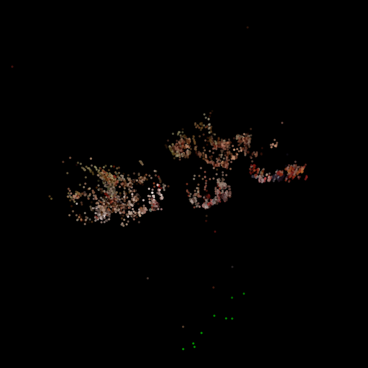
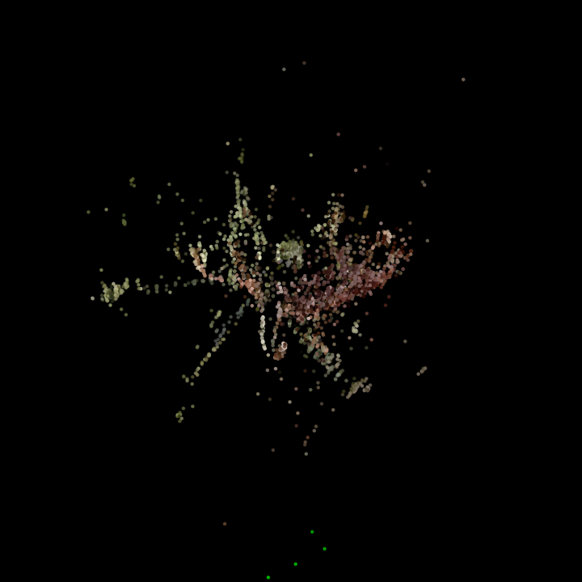

# Lab 2: Incremental Structure from Motion

Reconstruction of sparse 3D point clouds from uncalibrated image sequences, using classical two-view geometry (essential matrix estimation, RANSAC, triangulation) combined with a Ceres-based bundle adjustment refinement.

Course: 3D Data Processing, University of Padova.
Authors: Giuseppe D'Auria, Francesco Carretta, Anna Mainardis.

## Pipeline


- **Feature matching**: classical descriptors (SIFT via OpenCV) or a learned matcher (SuperGlue, see `src/superglue/superglue_script.py`), producing 2D correspondences across the image sequence.
- **Pose estimation**: essential matrix recovery from correspondences, decomposed into relative rotation and translation, with RANSAC to reject outlier matches.
- **Triangulation**: 2D correspondences and recovered poses are lifted to a sparse 3D point cloud.
- **Bundle adjustment**: joint non-linear refinement of camera poses and 3D points with Ceres Solver, minimizing reprojection error across all views.

## Results

Two calibrated image sequences were reconstructed end to end. Point clouds below are the actual `.ply` outputs in `results/`, rendered here for inspection (colors are the true per-point RGB values recovered from the source images).

| Dataset 1 (3466 points) | Dataset 2 (3839 points) |
|---|---|
|  |  |

Static views:




## Repository layout

```
lab2-structure-from-motion/
├── src/                  C++ implementation (matcher, basic_sfm, io_utils) and the SuperGlue matching script
├── datasets/             Input image sequences and camera calibration files
├── matching_files/       Precomputed correspondence files (classical and SuperGlue variants)
├── results/              Output point clouds (.ply)
├── report/               Full lab report and usage notes
├── assets/                Rendered figures used in this README
├── CMakeLists.txt
├── run_experiments.sh
└── BUILD.txt              Build and run instructions
```

## Build and run

See `BUILD.txt` for the full walkthrough. Summary:

```
mkdir build && cd build
cmake -DCMAKE_BUILD_TYPE=Release ..
make

./matcher ../datasets/3dp_cam.yml ../datasets/images_1 data1.txt 0 1.1
./basic_sfm data1.txt cloud1.ply
```

Dependencies: OpenCV, Ceres Solver, Eigen, yaml-cpp, Boost.Filesystem, OpenMP.

## Implementation notes

The two applications, `matcher` and `basic_sfm`, are decoupled through an intermediate correspondence file, which also allows the classical (SIFT-based) and learned (SuperGlue-based) matching front ends to be swapped without touching the reconstruction backend. During development, a template instantiation bug in the accumulation of correspondences via `std::vector::resize()` was identified and corrected, since the default-constructed elements introduced by an implicit resize were being treated as valid matches downstream.

The focal length scale factor (1.1 for the provided datasets) compensates for the difference between the calibrated intrinsics and the effective field of view of the capture device, and has a direct, visible effect on the metric scale and shape correctness of the recovered point cloud.
