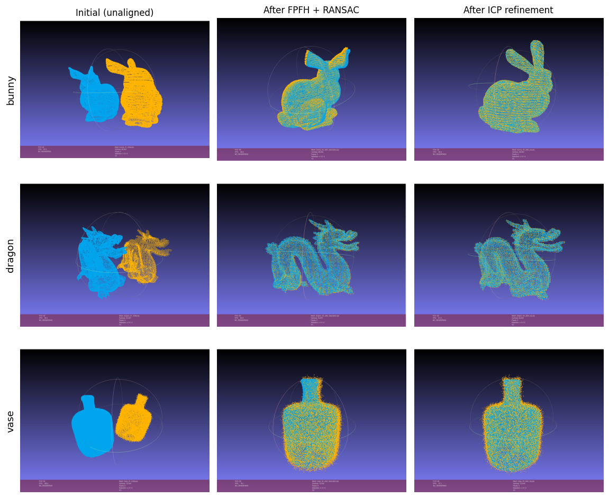
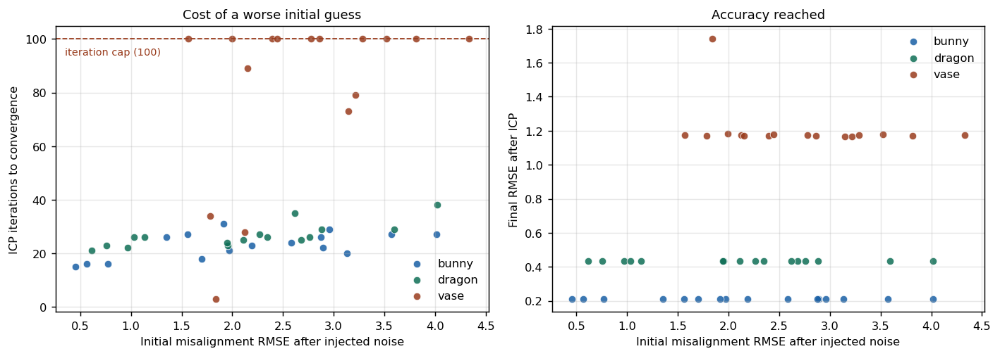
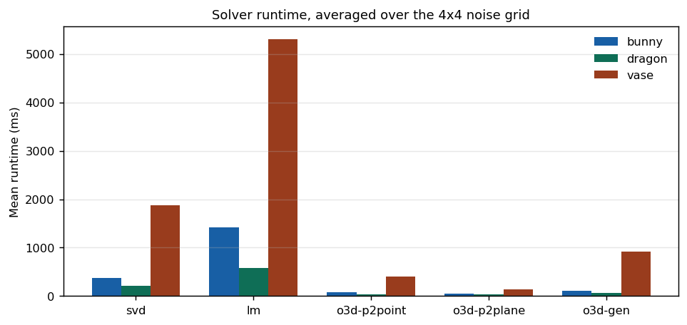

# Lab 3: Full Point Cloud Registration

Two-stage registration of partial 3D scans: FPFH descriptor matching with RANSAC gives a coarse global pose, then ICP refines it to convergence. Two ICP solvers were implemented from scratch (closed-form SVD and Levenberg-Marquardt via Ceres) and benchmarked against the three Open3D solvers across a 4 by 4 grid of injected pose noise.

Course: 3D Data Processing, University of Padova. Author: Giuseppe D'Auria.
Language: C++ with Open3D, Ceres, and Eigen.

## Results

Three datasets, three stages each. Source is painted orange, target blue, so the overlap is directly readable.



## The interesting part: where ICP stops working

The benchmark sweeps rotation noise (0, 3, 5, 10 degrees) against translation noise (0, 1, 3, 5 mm) and records iterations, runtime, and final RMSE for every solver. Two clearly different regimes emerge from the measured data.



**Bunny and dragon converge to an identical solution regardless of the initial guess.** Across all sixteen noise conditions, the final RMSE is exactly 0.212 for the bunny and 0.433 for the dragon, with no variation whatsoever. Degrading the initial alignment does not degrade the answer; it only costs iterations, from 15 up to 31 for the bunny and 21 up to 38 for the dragon. Neither ever approached the 100-iteration cap. In other words, the entire tested perturbation range lies inside the basin of convergence, and the descriptor stage delivers a starting pose comfortably within it.

**The vase does not behave this way.** 20 of the 32 custom-solver runs hit the iteration cap of 100, and the final RMSE is no longer a constant, drifting between 1.168 and 1.182 depending on the perturbation. The starkest result is the zero-noise case, which is worth reading carefully:

| Solver | Iterations | Final RMSE |
|---|---|---|
| svd (custom) | 3 | 1.739 |
| lm (custom) | 3 | 1.739 |
| o3d-p2point | n/a | 1.174 |
| o3d-p2plane | n/a | 1.169 |
| o3d-gen | n/a | 1.212 |

Starting from the initial misalignment of 1.839, the two custom solvers terminate after three iterations having barely improved anything, while every Open3D solver reaches roughly 1.17 on the same input. Injecting noise then *improves* the custom solvers' result, from 1.739 down to about 1.176. This is the signature of a relative-change stopping criterion firing on a plateau: the objective is locally flat near the starting pose, successive iterations produce a negligible RMSE delta, and the loop exits before reaching the true minimum. Perturbing the start displaces the solver off that plateau, so it descends properly. The vase geometry is the natural suspect for producing such a plateau, though the benchmark measures the symptom rather than the cause, so this remains a hypothesis rather than a demonstrated mechanism.

The practical lesson generalizes beyond this dataset: a convergence criterion based on relative improvement silently conflates "converged" with "not currently improving", and those are not the same condition.

## Solver cost



The closed-form SVD solver is roughly four times faster than the Ceres-based Levenberg-Marquardt formulation while reaching an identical final RMSE on every bunny and dragon condition. For point-to-point ICP, where the per-iteration subproblem has a closed-form solution via the Kabsch algorithm, handing that subproblem to a general non-linear optimizer buys nothing and costs a large constant factor.

## Two bugs in the starter code

Two latent defects in the originally distributed starter were identified and fixed independently during development, both later confirmed by the official TA correction:

1. **Accumulator composition order.** The incremental transform was being composed on the wrong side, so the accumulated pose diverged from the actual applied alignment across iterations.
2. **Keyword argument binding in `ICPConvergenceCriteria`.** Arguments were bound to the wrong parameters, meaning the convergence thresholds in effect were not the ones nominally specified.

This submission builds on the corrected starter the course subsequently released. The only modifications to `Registration.cpp` are the four required method bodies and the colouring added in `save_merged_cloud`.

## Layout

```
lab3-point-cloud-registration/
├── src/Registration.cpp, .h   The four implemented methods on the corrected starter
├── registration_trial.cpp     Driver: three-stage saves, threshold tuning, noise sweep
├── data/<dataset>/            Provided input clouds (source.ply, target.ply)
├── results/<dataset>/         Per-stage clouds and renders, benchmark table, final transform
├── report/                    Lab report
├── assets/                    Figures used in this README
├── CMakeLists.txt
└── BUILD.md                   Full build, run, and layout documentation
```

## Build and run

```
mkdir build && cd build
cmake ..
make

# Single registration; last argument selects the solver
./registration ../data/bunny/source.ply ../data/bunny/target.ply svd

# Full 4x4 noise grid across all five solvers
./registration ../data/bunny/source.ply ../data/bunny/target.ply all
```

Solvers: `svd`, `lm`, `o3d-p2point`, `o3d-p2plane`, `o3d-gen`. Dependencies: Open3D 0.19, Ceres with glog, Eigen 3, CMake 3.20 or newer, a C++23 compiler. See `BUILD.md` for details.
