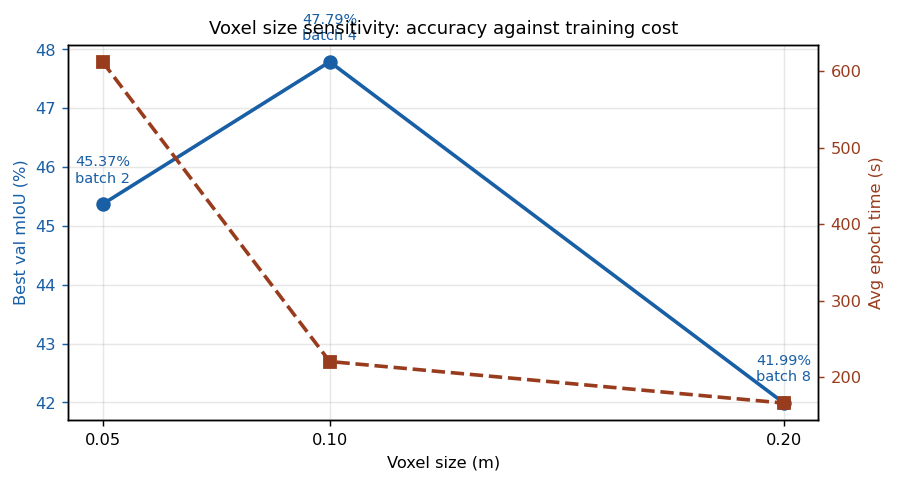

# Lab 4: Sparse Convolutional LiDAR Segmentation with MinkUNet

Semantic segmentation of outdoor LiDAR scans on SemanticPOSS using a MinkUNet built on the Minkowski Engine. The network operates directly on sparse voxelized point clouds rather than dense grids, which is what makes the problem tractable at all: a LiDAR scan occupies a tiny fraction of its bounding volume, so dense 3D convolution spends nearly all of its compute on empty space.

Course: 3D Data Processing, University of Padova. Author: Giuseppe D'Auria.
Languages: Python, PyTorch, MinkowskiEngine, trained on Google Colab.

## Implementation

Three components were implemented: the voxelization and collation pipeline that maps raw points to sparse tensor coordinates and handles batching, a custom sparse gated residual block, and the MinkUNet encoder-decoder with skip connections.

The gated residual block departs from a plain residual block by learning a multiplicative gate over the residual branch, so the network can attenuate its own contribution per-voxel rather than always adding it. Submanifold sparse convolutions are used throughout the trunk to prevent the progressive dilation of the active-site set that standard sparse convolution causes; without this constraint the tensor densifies layer by layer and the sparsity advantage disappears.

## Result 1: voxel size is a genuine tradeoff, not a monotone knob



| Voxel size (m) | Batch | Avg epoch time (s) | Best val mIoU, 5 epochs (%) |
|---|---|---|---|
| 0.05 | 2 | 612.04 | 45.37 |
| 0.10 | 4 | 220.56 | **47.79** |
| 0.20 | 8 | 166.27 | 41.99 |

The intuition that a finer voxel grid should be more accurate is wrong here, and measurably so. The 0.05 m grid is both the slowest (2.8 times the epoch time of 0.10 m) and less accurate than the middle setting.

Two effects run in opposite directions. Coarsening the voxels destroys geometric detail and merges distinct surfaces into shared voxels, which costs accuracy, and this dominates from 0.10 m to 0.20 m. But finer voxels also fragment each object across many more active sites while forcing the batch size down to fit memory, so at a fixed five-epoch budget the finest configuration sees fewer and noisier gradient updates per unit of wall-clock time. At this budget the two effects cross at 0.10 m.

The honest caveat: these runs are capped at five epochs, so the comparison measures accuracy *at a fixed short budget*, not converged accuracy. A longer schedule could plausibly reorder 0.05 m and 0.10 m, since the finer grid retains strictly more information. What the experiment does establish is that the finest grid is not free and not automatically better.

## Result 2: LiDAR remission carries substantial class-discriminative signal

An ablation comparing the full input (XYZ plus remission) against geometry alone, evaluated on the test set:


Overall mIoU rises from 26.92 percent to 33.66 percent, a gain of 6.75 points, but the aggregate hides how unevenly the benefit is distributed:

| Class | XYZ + remission | Geometry only | Delta |
|---|---|---|---|
| car | 62.73 | 23.58 | **+39.15** |
| person | 46.72 | 22.33 | **+24.39** |
| plants | 68.97 | 58.95 | +10.02 |
| bike | 49.41 | 41.21 | +8.20 |
| traffic_sign | 12.98 | 7.84 | +5.14 |
| ground | 74.08 | 71.33 | +2.75 |
| pole | 30.64 | 29.40 | +1.24 |
| building | 71.52 | 71.97 | -0.45 |
| fence | 20.55 | 23.29 | -2.74 |
| **mIoU** | **33.66** | **26.92** | **+6.75** |

Almost the entire gain comes from two classes. Car and person together account for a large majority of the improvement, and both are classes whose surface reflectivity differs sharply from their surroundings: painted metal and glass for vehicles, clothing and skin for pedestrians. Meanwhile building and fence get marginally *worse* with remission, which is consistent with these being large planar structures already well separated by geometry alone, where an extra input channel mostly adds variance.

Four classes (rider, trunk, trashcan, cone_stone) score exactly zero IoU under both configurations. These are the rare classes in SemanticPOSS, and a zero here indicates the model never predicts them at all rather than predicting them badly, the expected failure mode of an unweighted cross-entropy objective on a long-tailed class distribution.

## Layout

```
lab4-minkunet-segmentation/
├── 3DP2026_Lab_4_MinkUNet.ipynb   Full notebook: implementation, training, both studies
├── report/                        Lab report
└── assets/                        Figures used in this README
```

## Running

The notebook is written for Google Colab with Python 3.11 and CUDA 12.5, and the first cell handles the environment setup including the Minkowski Engine build. Checkpoints and result tables are cached to Google Drive between runs, so completed experiments are skipped on re-execution rather than retrained.
